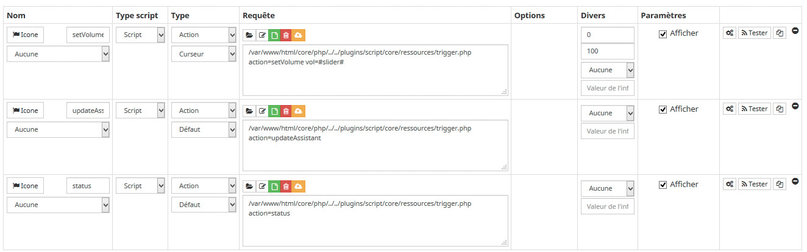
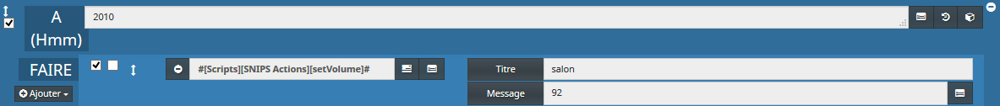

# SNIPS-Jeedom Actions

Here are three scripted actions that can be handy for Jeedom users:
- setVolume : Change the output volume of your SNIPS TTS.
- updateAssistant : update your main snips server assistant (after changing stuff in console for exemple)
- status : getting snips server status

These three actions are basically some ssh command you would have to start on the Pi, connected by ssh or with screen / keyboard. For example, if you change something on your assistant console, you have then to go on your snips Pi to update this assistant with 'sam update-assistant'. This allow you to trigger such command directly from Jeedom, avoiding the need to ssh the Pi.

The script handling these commands is designed so you can add more commands later. You can have a look to [JeedomTTSremap](JeedomTTSremap "JeedomTTSremap") for example.

### How to

We will create a plugin script with three commands.

- If you don't have it yet, install the plugin 'Script'
- Go into menu Plugins/Programmation/Script
- Create a new script equipment and name it SNIPS_Actions
- On command tab, create a three commands and set them as below:



Then copy the script below into the script of the commands. All three commands will start the same script, with the action to do.
Set your SNiPS Raspberry IP, ssh login and password in the first line.

> The setVolume command works for a Pi3B+ with a Respeaker 2 Mics Pi HAT. If you are using SNIPS on different hardware, you may need to the following line:

 ```php
 $cmd = "amixer -c 1 set Playback ".$vol."%";
 ```

You are done !

### Script to be run

```php
<?php
include('/var/www/html/core/class/scenario.class.php');


$snipsip = '192.168.x.y';
$sshlogin = 'my.ssh.login.to.the.pi';
$sshpass = 'mypass';

if (isset($argv)) {
	foreach ($argv as $arg) {
		$argList = explode('=', $arg);
		if (isset($argList[0]) && isset($argList[1])) {
			$_GET[$argList[0]] = $argList[1];
		}
	}
}
$action = 'default';
if(isset($_GET['action'])) $action = $_GET['action'];
if ($action != 'default') call_user_func($action);


//===========actions:
function setVolume()
{
  	global $snipsip, $sshlogin, $sshpass;
  	if(isset($_GET['vol']))
  	{
		$vol = $_GET['vol'];
		$cmd = "amixer -c 1 set Playback ".$vol."%";
		$connection = ssh2_connect($snipsip, 22);
		ssh2_auth_password($connection, $sshlogin, $sshpass);
		$stream = ssh2_exec($connection, $cmd);
  	}
}

function status()
{
  	global $snipsip, $sshlogin, $sshpass;
  	$cmd = "sam status";
  	$logDir='/var/www/html/log/snips_piserver';

  	$ssh = ssh2_connect($snipsip, 22);
	ssh2_auth_password($ssh, $sshlogin, $sshpass);
	$stream = ssh2_exec($ssh, $cmd);
	stream_set_blocking($stream, true);

  	//log output:
  	$log = fopen($logDir,"a");
	fputs($log, date("Y-m-d H:i:s",strtotime('now')) . "\n");
	while($buffer = fread($stream, 4096)) {
  		fputs($log,$buffer);
	}
	fputs($log,date("Y-m-d H:i:s",strtotime('now')) . "\n");
	fclose($log);
	fclose($stream);
}


function updateAssistant()
{
  	global $snipsip, $sshlogin, $sshpass;
  	$cmd = "sam update-assistant";
  	$logDir='/var/www/html/log/snips_piserver';

  	$ssh = ssh2_connect($snipsip, 22);
	ssh2_auth_password($ssh, $sshlogin, $sshpass);
	$stream = ssh2_exec($ssh, $cmd);
	stream_set_blocking($stream, true);

  	//log output:
  	$log = fopen($logDir,"a");
	fputs($log, date("Y-m-d H:i:s",strtotime('now')) . "\n");
	while($buffer = fread($stream, 4096)) {
  		fputs($log,$buffer);
	}
	fputs($log,date("Y-m-d H:i:s",strtotime('now')) . "\n");
	fclose($log);
	fclose($stream);
}

?>
```

Now, you can use them in a scenario:
- Set TTS volume higher in the morning for all day, and lower in the evening.

You can also put these actions on your dashboard in a Virtual. Or simple going back into your script equipments, commands tab and hit 'test' button.
For updateAssistant and status, the result answer from the Pi will appear in a new log named snips-piserver (Analyse / Logs)

### Master/Satellite volume

If you have a Master and some satellite(s), you won't have to create other setVolume commands.

Just change the setVolume script command to Message type, with path/to/script.php action=setVolume device=#title# vol=#message#</br>
Then inside the code, change the function like this:

```php
function setVolume()
{
   	global $snipsip, $sshlogin, $sshpass;
  	$device = $_GET['device'];
  	$vol = $_GET['vol'];
  	if (strtolower($device) == 'salon') $snipsip = '192.168.0.x';
  	if (strtolower($device) == 'chambre') $snipsip = '192.168.0.y';
  
  	$vol = $_GET['vol'];
  	$cmd = "amixer -c 1 set Playback ".$vol."%";
  	$connection = ssh2_connect($snipsip, 22);
  	ssh2_auth_password($connection, $sshlogin, $sshpass);
  	$stream = ssh2_exec($connection, $cmd);
}
```
Take care to change or add others satellite(s) in the function with their name / IP.
Then in your scenario, call it like this:




### Snips Led Control: Turn LEDs off at night!

Here is a goodie if you use [SLC - Snips Led Control](https://github.com/Psychokiller1888/snipsLedControl).
Add these functions in your script, and ad two ledsOn and ledsOff commands. So, you can turn leds off at night :blush:

Change siteId if necessary (default is ... {\"siteId\" : \"default\"})


```php
function ledsoff()
{
   	global $snipsip, $sshlogin, $sshpass;
  	$cmd = "mosquitto_pub -p 1883 -t 'hermes/leds/toggleOff' -m '{\"siteId\" : \"salle\"}'";
  	$connection = ssh2_connect($snipsip, 22);
  	ssh2_auth_password($connection, $sshlogin, $sshpass);
  	$stream = ssh2_exec($connection, $cmd);
}

function ledson()
{
   	global $snipsip, $sshlogin, $sshpass;
  	$cmd = "mosquitto_pub -p 1883 -t 'hermes/leds/toggleOn' -m '{\"siteId\" : \"salle\"}'";
  	$connection = ssh2_connect($snipsip, 22);
  	ssh2_auth_password($connection, $sshlogin, $sshpass);
  	$stream = ssh2_exec($connection, $cmd);
}
```

-----------------

#### 2018-10-05
- setVolume for Master/Satellite(s)

#### 2018-10-03
- First public version


## License

The MIT License (MIT)

Copyright (c) 2018 KiboOst

Permission is hereby granted, free of charge, to any person obtaining a copy
of this software and associated documentation files (the "Software"), to deal
in the Software without restriction, including without limitation the rights
to use, copy, modify, merge, publish, distribute, sublicense, and/or sell
copies of the Software, and to permit persons to whom the Software is
furnished to do so, subject to the following conditions:

The above copyright notice and this permission notice shall be included in all
copies or substantial portions of the Software.

THE SOFTWARE IS PROVIDED "AS IS", WITHOUT WARRANTY OF ANY KIND, EXPRESS OR
IMPLIED, INCLUDING BUT NOT LIMITED TO THE WARRANTIES OF MERCHANTABILITY,
FITNESS FOR A PARTICULAR PURPOSE AND NONINFRINGEMENT. IN NO EVENT SHALL THE
AUTHORS OR COPYRIGHT HOLDERS BE LIABLE FOR ANY CLAIM, DAMAGES OR OTHER
LIABILITY, WHETHER IN AN ACTION OF CONTRACT, TORT OR OTHERWISE, ARISING FROM,
OUT OF OR IN CONNECTION WITH THE SOFTWARE OR THE USE OR OTHER DEALINGS IN THE
SOFTWARE.
