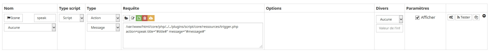
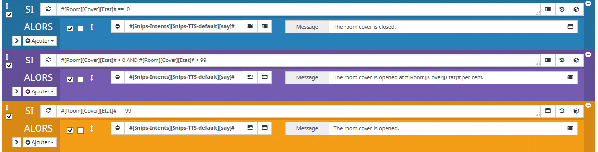
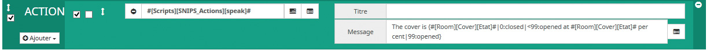

# SNIPS-Jeedom TTS remapping

Actually, using TTS command (being snips or whatever) in a Jeedom scenario, we can dynamically call some value like this:
- The cover in the living-room is at #[Room][Cover][Etat]#.

This is great of course, but very limiting for TTS use.

*Examples:*
For a light, we would use "on" or "off" instead of 1 or 0 value.
For a cover, we would even use "close" for 0, "opened" for 99, or "opened at x" for a value between 0 and 99.

Actually we can only do this in the scenario with IF blocs, for each possible value/range, giving a different sentence to TTS.

What we will setup here is a way to write TTS sentences that will handle such cases, like this:
- The light is actually {#[Room][Light][Etat]#|0:off|1:on}.
- The cover is {#[Room][Cover][Etat]#|0:closed|<99:opened at #[Room][Cover][Etat]# per cent|99:opened}

*I guess these two examples cover enough cases to not explain them for hours...*

### How to

To handle this directly in the snips tts command, we would need to modify the Jeedom core to interpret such parameters right. Of course we won't!

So, we will create a plugin script command and use it instead of the normal snips tts command (#[Snips-Intents][Snips-TTS-default][say]#). This command will then filter the message, before sending it to the snips 'say' command.

- If you don't have it yet, install the plugin 'Script'
- Go into menu Plugins/Programmation/Script
- Create a new script equipment and name it SNIPS_Actions
- On command tab, create a new command and set it as below:



The request should be like this:
/var/www/html/core/php/../../plugins/script/core/ressources/trigger.php  action=speak title="#title#" message="#message#"

So in a scenario, you will have a new command SNIPS_Actions / speak with a title and a message field. These will be passed to the script with parameters title="#title#" message="#message#".

Then copy the script below into the script of the command. Set your SNiPS Raspberry IP, ssh login and password in the first line.

You are done !

### Script to be run
Here is the script that will be triggered by our new Speak command.
You can notice that it is designed to handle other actions you can add into.

```php
<?php
include('/var/www/html/core/class/scenario.class.php');

$snipsip = '192.168.x.y';
$sshlogin = 'my.ssh.login.to.the.pi';
$sshpass = 'mypass';

if (isset($argv)) {
	foreach ($argv as $arg) {
		$argList = explode('=', $arg);
		if (isset($argList[0]) && isset($argList[1])) {
			$_GET[$argList[0]] = $argList[1];
		}
	}
}
$action = 'default';
if(isset($_GET['action'])) $action = $_GET['action'];
if ($action != 'default') call_user_func($action);


//===========actions:
function speak()
{
	$title = $_GET['title'];
    	$message = $_GET['message'];
  	$message = evalDynamicString($message);
	speakNow($message);
}

//=====functions:
function speakNow($message)
{
  	$cmd = cmd::byString('#[Snips-Intents][Snips-TTS-default][say]#');
    $cmd->execCmd($options=array('title'=>'', 'message'=>$message), $cache=0);
}

function evalDynamicString($_string)
{
	if (strpos($_string, '{') !== false AND strpos($_string, '}') !== false)
	{
		try {
			preg_match_all('/{(.*?)}/', $_string, $matches);
			foreach ($matches[0] as $expr_string)
			{
				$expr = substr($expr_string, 1, -1);
				$exprAr = explode('|', $expr);
				$value = $exprAr[0];
				array_shift($exprAr);

				$valueString = '';
				foreach ($exprAr as $thisExpr)
				{
					$evaluateString = 'return ';
					$parts = explode(':', $thisExpr);
					if ( $parts[0][0] != '<' AND $parts[0][0] != '>') $parts[0] = '=='.$parts[0];

					$test = eval("return ".$value.$parts[0].";");
					if ($test)
					{
					     $valueString = $parts[1];
					}

					if ($valueString != '') break;
				}

				$_string = str_replace($expr_string, $valueString, $_string);
			}

			return $_string;
		} catch (Exception $e) {
			return $_string;
		}
	}
	else return $_string;
}

?>
```

Here is an example of a scenario handling cover answer with default snips tts command:



And now, using the one we just created:




You are basically now doing a filter between the scenario and the snips real tts command.
So, you can put a lot different things and filters into this script to do other things. For example transforming '.' to 'coma', not triggering instantly the tts command but on next movement in the room, and so on...

-----------------
#### 2018-10-04
First public version


## License

The MIT License (MIT)

Copyright (c) 2018 KiboOst

Permission is hereby granted, free of charge, to any person obtaining a copy
of this software and associated documentation files (the "Software"), to deal
in the Software without restriction, including without limitation the rights
to use, copy, modify, merge, publish, distribute, sublicense, and/or sell
copies of the Software, and to permit persons to whom the Software is
furnished to do so, subject to the following conditions:

The above copyright notice and this permission notice shall be included in all
copies or substantial portions of the Software.

THE SOFTWARE IS PROVIDED "AS IS", WITHOUT WARRANTY OF ANY KIND, EXPRESS OR
IMPLIED, INCLUDING BUT NOT LIMITED TO THE WARRANTIES OF MERCHANTABILITY,
FITNESS FOR A PARTICULAR PURPOSE AND NONINFRINGEMENT. IN NO EVENT SHALL THE
AUTHORS OR COPYRIGHT HOLDERS BE LIABLE FOR ANY CLAIM, DAMAGES OR OTHER
LIABILITY, WHETHER IN AN ACTION OF CONTRACT, TORT OR OTHERWISE, ARISING FROM,
OUT OF OR IN CONNECTION WITH THE SOFTWARE OR THE USE OR OTHER DEALINGS IN THE
SOFTWARE.
