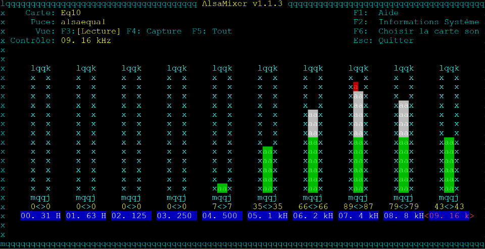

# Equalizer for Snips voice

Here is how to use ALSA equal plugin with SNIPS.

Snips actually use PicoTTS voice, which isn't the most natural voice, not saying that these is a lot of choice in free voice.

On portable/bluetooth speakers, fashion is actually on extra bass. This provide a totally unatural sound. Sometimes, the TTS is even hard to understand !

Previously using PicoTTS on a Raspberry with an HifiBerry card with a Sony SRS XB20 speaker, I had same problem and solved it with alsa plugin equal.

So, here is how to install and set it up with Snips. Using here a Raspberry Pi3B+ with Respeaker 2 mic Pi HAT.



### How to

Connect to your pi with ssh, and install the plugin:

> sudo apt-get install -y libasound2-plugin-equal

This will put the file of the plugin in /home/pi/.alsaequal.bin (if you are using pi user). This file is the one used by the snips audio server, so we will move it, and set _snips user permissions to use it. Otherwise, snips service won't be able to load it, and will crash.

> sudo mkdir /var/empty
sudo cp /home/pi/.alsaequal.bin /var/empty/.alsaequal.bin
sudo chown _snips: /var/empty/.alsaequal.bin

Checkout your cards:

> aplay -l

You should see your respeaker on card 1. This may differ if you have disabled the default sound card, or if you have another card.
Note the card/device number used for output, or its name.

Edit asound.conf:

> sudo nano -c /etc/asound.conf

And copy, or adapt, the content into.
Here I use the name of the card. It could also be hw:1,0

```
    pcm.!default {
    type asym
    playback.pcm {
        type plug
        slave.pcm "plugequal"
    }
    capture.pcm {
        type plug
        slave.pcm "hw:seeed2micvoicec"
    }
}
#equalizer:
ctl.equal {
 type equal
}
pcm.plugequal {
 type equal
 slave.pcm "plughw:seeed2micvoicec"
}
pcm.equal {
 type plug
 slave.pcm plugequal
}
```
You can now restart snips audio server:

> sudo systemctl restart snips-audio-server

Now, set the equalizer. You can play a long text in a TTS command to be able to adjust equalizer in realtime.

> sudo alsamixer -D equal

Once you are done, store the settings so they get reloaded at startup:

> sudo alsactl store

Done!
